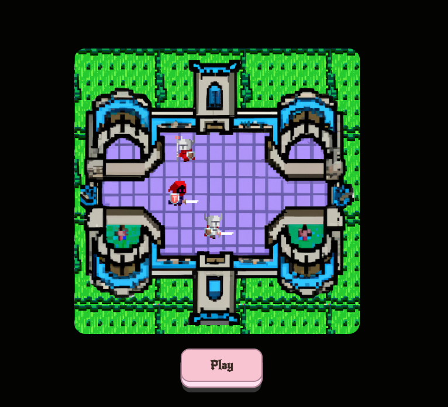
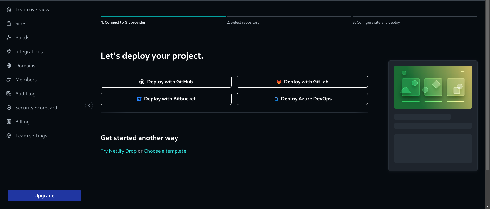
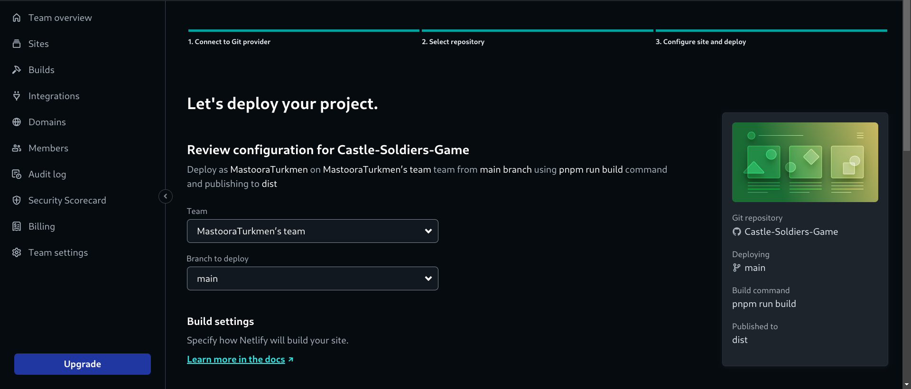
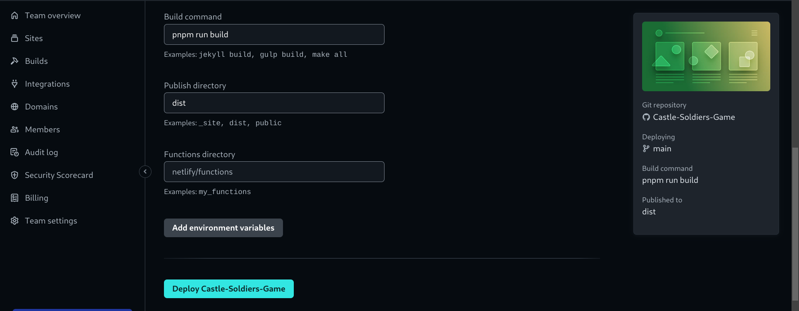

# Castle Soldiers Game ⛏ ⚔️ 🛡 🤺

> A very simple castle soldiers game war. Just Moving there and over there.😅😂

https://castle-soldiers-game.netlify.app/


------


## Screenshots 📸





--------

## Before you Begin 🛠 🔨

Quick start:

````
$ npm install
$ npm run dev
$ npm start
````

````
$ pnpm install
$ pnpm run dev
$ pnpm start
````

````
$ yarn install
$ yarn run dev
$ yarn start
````

Head over to https://vitejs.dev/ to learn more about using vite

-------

## Cloning the project 🪛🔨

````
# Clone this repository
$ git clone https://github.com/MastooraTurkmen/Castle-Soldiers-Game.git

# Go inside the repository
$ cd Castle-Soldiers-Game
````

------

## Languages and Tools are used 🗣️🔧

1. **Languages** 🗣️

    + [HTML](https://github.com/topics/html)
    + [HTML5](https://github.com/topics/html5)
    + [CSS](https://github.com/topics/css)
    + [CSS3](https://github.com/topics/css3)
    + [React](https://github.com/topics/react)
    + [JavaScript](https://github.com/topics/javascript)

2. **Tools** 🔧

    + [Chrome](https://github.com/topics/chrome)
    + [Figma](https://github.com/topics/figma)
    + [VSCode](https://github.com/topics/vscode)
    + [Netlify](https://github.com/topics/netlify)

------


## Deployment 📥

1. How to deploy our project to the Netlify site?
2. I use [Netlify App](https://app.netlify.com/) for deploying my projects.
4. From there select **_Deploy with Github_**.
   
5. Then write your project name and select it.
6. After selecting here you can see that the project **_Review configuration for Castle-Soldiers-Game_** and then select the **_Deploy Castle-Soldiers-Game_** Button.
  
  
7. Now your project is Live.


------

# React + Vite

This template provides a minimal setup to get React working in Vite with HMR and some ESLint rules.
Currently, two official plugins are available:

- [@vitejs/plugin-react](https://github.com/vitejs/vite-plugin-react/blob/main/packages/plugin-react/README.md) uses [Babel](https://babeljs.io/) for Fast Refresh
- [@vitejs/plugin-react-swc](https://github.com/vitejs/vite-plugin-react-swc) uses [SWC](https://swc.rs/) for Fast Refresh


-----


## Updating the images to the direct links 🔗 🖇

I updated image data to direct links because when I uploaded to Netlify, my images didn't show,
so I used the ***"PostImages"*** https://postimages.org/


------

## Author 👩‍💻

**Mastoora Turkmen**  
[LinkedIn](https://www.linkedin.com/in/mastoora-turkmen/) 
<br>
[Github](https://github.com/MastooraTurkmen/) 
<br>
[Twitter](https://twitter.com/MastooraJ22)
<br>


# Cods that are used

## Data Js

```js
import { nanoid } from "nanoid"

export default [
	{
	   id: nanoid(),
           currentImage: "https://i.postimg.cc/gJk2m08R/enemy1A.png",
	   altImage: "https://i.postimg.cc/JzfXrjzX/enemy1B.png",
	   orientation: "left",
	   position: {
		top: 210,
		left: 157,
	}
	},{
		id: nanoid(),
		currentImage: "https://i.postimg.cc/8cpM8DPn/enemy2A.png",
		altImage: "https://i.postimg.cc/SKYGVyJ6/enemy2B.png",
		orientation: "right",
		position: {
			top: 105,
			left: 187,
		}
	},{
		id: nanoid(),
		currentImage: "https://i.postimg.cc/d3j6d4Dg/enemy3A.png",
		altImage: "https://i.postimg.cc/ZR12j7bR/enemy3B.png",
		orientation: "right",
		position: {
			top: 165,
			left: 165,
		}
	},
]

```

## App JSX

```jsx

import React from "react"
import Enemy from "./components/Enemy"
import Button from "./components/Button"
import runGame from "./utilities/runGame"
import initialEnemyData from "./data/initialEnemyData"

export default function App() {
	
	const [gameRunning, setGameRunning] = React.useState(false)
	const [enemiesData, setEnemiesData] = React.useState(initialEnemyData)
   
    runGame(gameRunning, setEnemiesData)
	const enemies = enemiesData.map(enemy => <Enemy key={enemy.id} {...enemy} /> )
	
	return (
		<div className="wrapper">
			<div className="meadow-container">
				<div className="castle-container">
					{enemies}
				</div>
			</div>
			<Button stateProps={{ gameRunning, setGameRunning }} />
		</div>
	)
}

```


## Index JsX

```jsx
import React from "react"
import ReactDOM from "react-dom/client"
import App from "./App"

ReactDOM.createRoot(document.getElementById("root")).render(<App />)

```


## Components

***1. Button.jsx***
***2. Enemy.jsx***


### Button JSX

```jsx
import React from "react"

export default function Button({ stateProps }) {
	return (
		<div className="button-container">
			<button
				onClick={() => stateProps.setGameRunning(!stateProps.gameRunning)}
			>
				{stateProps.gameRunning ? "Pause" : "Play"}
			</button>
		</div>
	)
}
```


### Enemy JSX

```jsx

import React from "react"

export default function Enemy(props) {
	return (
		<div
			className="enemy"
			style={{
				top: `${props.position.top}px`,
				left: `${props.position.left}px`,
				transform: props.orientation === "left" ? "scaleX(-1)" : null,
			}}
		>
			
		</div>
	)
}

```


## RunGame JS

```js
import React from "react"

export default function runGame(gameRunning, setEnemiesData) {
    
  React.useEffect(() => {
	let interval
	if (gameRunning) {
	  interval = setInterval(() => {
		setEnemiesData(prevPositions => {
		  return prevPositions.map(enemy => {

		   let nextOrientation
		   let nextPosition
		   let nextCurrentImage = enemy.currentImage
		   let nextAltImage = enemy.altImage
		   let leftBoundary = enemy.position.top === 165 ? 37 : 112
		   let rightBoundary = enemy.position.top === 165 ? 292 : 202

			if (
				enemy.position.left > leftBoundary &&
				enemy.orientation === "left"
			) {
				nextOrientation = "left"
				nextPosition = enemy.position.left - 1
			} else if (
				enemy.position.left === leftBoundary &&
				enemy.orientation === "left"
			) {
				nextOrientation = "right"
				nextPosition = enemy.position.left - 1
			} else if (
				enemy.position.left < rightBoundary &&
				enemy.orientation === "right"
			) {
				nextOrientation = "right"
				nextPosition = enemy.position.left + 1
			} else if (
				enemy.position.left === rightBoundary &&
				enemy.orientation === "right"
			) {
				nextOrientation = "left"
				nextPosition = enemy.position.left - 1
			} 
			
			if (enemy.position.left % 10 === 0) {
				nextCurrentImage = enemy.altImage
				nextAltImage = enemy.currentImage
			}

			return {
				...enemy,
				orientation: nextOrientation,
				currentImage: nextCurrentImage,
				altImage: nextAltImage,
				position: { ...enemy.position, left: nextPosition },
			}
		  })
		 })
	  }, 20)
   }
	return () => clearInterval(interval) 
  }, [gameRunning])
}

```

## Style CSS


```css

* {
     box-sizing: border-box;
}

 body {
     width: 100vw;
     height: 100vh;
     display: flex;
     justify-content: center;
     align-items: center;
     background: #030301;
}

.meadow-container {
     margin-left: -13px;
     border-radius: 15px;
     background: darkgreen;
     background-image: url(./images/meadow.png);
     background-size: 30%;
     width: 390px;
     height: 390px;
     display: flex;
     justify-content: center;
     align-items: center;
}

.castle-container {
     background-image: url(./images/castle.png);
     width: 375px;
     height: 375px;
     margin-top: 15px;
     background-size: contain;
     background-repeat: no-repeat;
     position: relative;
}

.enemy {
     position: absolute;
     filter: contrast(2) brightness(1.2) 
}
.enemy img {
     width: 45px;
}

.button-container {
     display: flex;
     justify-content: center;
     margin-top: 20px;
}

button {
     width: 112px;
     position: relative;
     display: inline-block;
     cursor: pointer;
     outline: none;
     border: 0;
     vertical-align: middle;
     text-decoration: none;
     font-family: inherit;
     font-size: 16px;
     font-weight: 700;
     color: #382b22;
     padding: .75em .5em;
     background: #f9c4d2;
     border: 2px solid #b18597;
     border-radius: 0.75em;
     -webkit-transform-style: preserve-3d;
     transform-style: preserve-3d;
     -webkit-transition: background 150ms cubic-bezier(0, 0, 0.58, 1), 
                         -webkit-transform 150ms cubic-bezier(0, 0, 0.58, 1);
     transition: transform 150ms cubic-bezier(0, 0, 0.58, 1), 
                 background 150ms cubic-bezier(0, 0, 0.58, 1), 
                 -webkit-transform 150ms cubic-bezier(0, 0, 0.58, 1);
     font-family: 'New Rocker', cursive;
}

button::before {
     position: absolute;
     content: '';
     width: 100%;
     height: 100%;
     top: 0;
     left: 0;
     right: 0;
     bottom: 0;
     background: #ffe0f0;
     border-radius: inherit;
     -webkit-box-shadow: 0 0 0 2px #b18597, 0 0.625em 0 0 #ffe3e2;
     box-shadow: 0 0 0 2px #b18597, 0 0.625em 0 0 #ffe3e2;
     -webkit-transform: translate3d(0, 0.75em, -1em);
     transform: translate3d(0, 0.75em, -1em);
     transition: transform 150ms cubic-bezier(0, 0, 0.58, 1), 
                 box-shadow 150ms cubic-bezier(0, 0, 0.58, 1), 
                 -webkit-transform 150ms cubic-bezier(0, 0, 0.58, 1), 
                 -webkit-box-shadow 150ms cubic-bezier(0, 0, 0.58, 1);
}
```