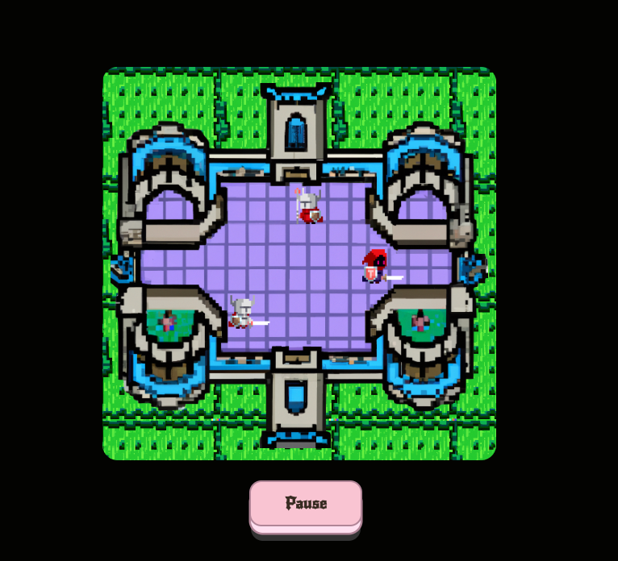

# Castle Soldiers Game ⛏ ⚔️ 🛡 🤺

A very simple caslte soldiers game war. Just Moving there and over there.😅😂

https://castle-soldiers-game.netlify.app/

## Screenshots 📸





## Before you Begin 🛠 🔨

Quick start:

````
$ npm install
$ npm run dev
$ npm start
````

````
$ pnpm install
$ pnpm run dev
$ pnpm start
````

````
$ yarn install
$ yarn run dev
$ yarn start
````

Head over to https://vitejs.dev/ to learn more about using vite

## Cloning the project 🪛🔨

````
# Clone this repository
$ git clone https://github.com/MastooraTurkmen/Castle-Soldiers-Game.git

# Go inside the repository
$ cd Castle-Soldiers-Game
````

------

## Languages and Tools are used 🗣️🔧

1. **Languages** 🗣️

    + [HTML](https://github.com/topics/html)
    + [HTML5](https://github.com/topics/html5)
    + [CSS](https://github.com/topics/css)
    + [CSS3](https://github.com/topics/css3)
    + [React](https://github.com/topics/react)
    + [JavaScript](https://github.com/topics/javascript)

2. **Tools** 🔧
    + [Chrome](https://github.com/topics/chrome)
    + [Figma](https://github.com/topics/figma)
    + [VSCode](https://github.com/topics/vscode)
    + [Netlify](https://github.com/topics/netlify)

------


## Deployment 📥

1. How to deploy our project to the Netlify site?
2. I use [Netlify App](https://app.netlify.com/) for deploying my projects.
4. From there select **_Deploy with Github_**.
   
5. Then write your project name and select it.
6. After selecting here you can see that the project **_Review configuration for Castle-Soldiers-Game_** and then select the **_Deploy Castle-Soldiers-Game_** Button.
  
  
7. Now your project is Live.


------

# React + Vite

This template provides a minimal setup to get React working in Vite with HMR and some ESLint rules.
Currently, two official plugins are available:

- [@vitejs/plugin-react](https://github.com/vitejs/vite-plugin-react/blob/main/packages/plugin-react/README.md) uses [Babel](https://babeljs.io/) for Fast Refresh
- [@vitejs/plugin-react-swc](https://github.com/vitejs/vite-plugin-react-swc) uses [SWC](https://swc.rs/) for Fast Refresh


-----


## Updating the images to the direct links

I updated image data to direct links because when I uploaded to Netlify, my images didn't show,
so I used the ***"PostImages"*** https://postimages.org/


------

## Author 👩‍💻

**Mastoora Turkmen**  
[LinkedIn](https://www.linkedin.com/in/mastoora-turkmen/) 
<br>
[Github](https://github.com/MastooraTurkmen/) 
<br>
[Twitter](https://twitter.com/MastooraJ22)
<br>
